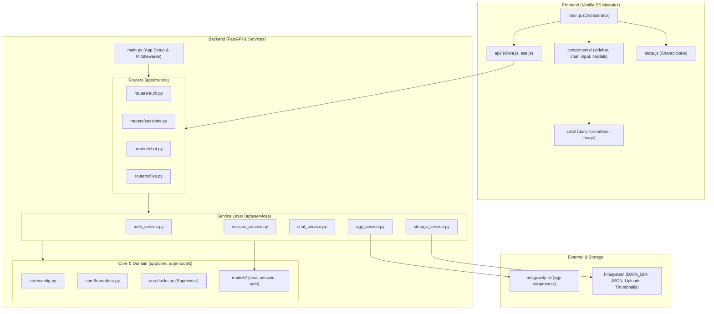

# RememberBot - Architectural Blueprint & Design System

Dieses Dokument beschreibt die modulare, schichtenbasierte Architektur von **RememberBot**. Die Codebase folgt den Prinzipien des **Clean Architecture**-, **Domain-Driven Design (DDD)**- und **Test-Driven Development (TDD)**-Ansatzes.

---

## 1. Schichtenarchitektur (Overview)

---

## 2. Backend-Architektur

### 2.1 Core-Schicht (`app/core/`)
- **[`config.py`](file:///apps/app/core/config.py)**: Zentralisierte Konfiguration und Konstanten (Dateigrößenlimits, Timeout-Werte wie `ICON_GENERATION_TIMEOUT_SECONDS` [Standard: 180s], Security-Flags, Cookie-Attribute, Modell-Katalog `MODEL_CATALOG` und Standardwerte `AGY_DEFAULT_MODEL` [Standard: `gemini-3.8-flash`] / `AGY_DEFAULT_THINKING_EFFORT` [Standard: `medium`] mit `validate_model_and_effort()`).
- **[`formatters.py`](file:///apps/app/core/formatters.py)**: Reine Transformations- und Formatierungsfunktionen (z. B. `<thought>`-Folding, Markdown-Pfad-Umschreibung, SVG-Sanitization).
- **[`tasks.py`](file:///apps/app/core/tasks.py)**: `BackgroundSupervisor` für Task-Tracking, Session-Locking und Exception-Logging bei Hintergrundoperationen (`fire_and_forget`).

### 2.2 Domain-Modelle (`app/models/`)
- **[`chat.py`](file:///apps/app/models/chat.py)**: `ChatMessage`, `AttachmentMeta`, `ChatStatusResponse`.
- **[`session.py`](file:///apps/app/models/session.py)**: `SessionMetadata`, `SessionSettings`, `SessionSettingsRequest` (inkl. `model` und `thinking_effort`), `SessionCreateResponse`.
- **[`auth.py`](file:///apps/app/models/auth.py)**: `LoginRequest`, `AuthStatusResponse`.

### 2.3 Service-Schicht (`app/services/`)
- **[`auth_service.py`](file:///apps/app/services/auth_service.py)**: Kapselt Benutzer-Authentifizierung, Session-Token-Lebenszyklus, Cookie-Verwaltung und Rate-Limiting gegen Brute-Force-Angriffe.
- **[`storage_service.py`](file:///apps/app/services/storage_service.py)**: Verantwortlich für atomare JSON-Schreibzugriffe (mit Temp-Files und `os.replace`), Dateisystem-Locks, On-Demand-Thumbnail-Erstellung und temporäre Bereinigungen.
- **[`session_service.py`](file:///apps/app/services/session_service.py)**: Verwaltet Session-Lebenszyklen (CRUD), Einstellungs- und Titel-Updates, Historienverwaltung und ZipSlip-geschützte ZIP-Exporte/Importe mit automatischer URL- und Pfad-Remappung.
- **[`agy_service.py`](file:///apps/app/services/agy_service.py)**: Kapselt die `agy`-CLI-Subprozess-Ausführung mit nativer Session-Fortführung (`--conversation <id>`), One-Time-History-Seeding bei bestehenden/importierten Sessions, DB-Prüfung (`conversation_exists`), dynamischer Parameterübergabe (`--model`, `--effort`), NDJSON-Stream-Parsing und SVG-Avatar-Generierung.
- **[`chat_service.py`](file:///apps/app/services/chat_service.py)**: Orchestriert die Konversationslogik, Anhänge, GPS-Standorteinspeisung, Historienpersistierung und entkoppelte SSE-Token-Streams.

### 2.4 Router-Schicht (`app/routers/`)
- **[`auth.py`](file:///apps/app/routers/auth.py)**: Endpunkte für Login, Logout und Authentifizierungsstatus (`/api/auth/*`).
- **[`sessions.py`](file:///apps/app/routers/sessions.py)**: Endpunkte für Session-Management, Status, Historie, Einstellungen, Titel, Icons, Modell-Katalog (`GET /api/sessions/models/catalog`) sowie Export und Import (`/api/sessions/*`).
- **[`chat.py`](file:///apps/app/routers/chat.py)**: Endpunkt für Chat-Nachrichten und SSE-Streaming (`/api/sessions/{id}/chat`).
- **[`files.py`](file:///apps/app/routers/files.py)**: Datei- und Thumbnail-Auslieferung (`/uploads/*`, `/app/data/*`).

### 2.5 Orchestrator (`app/main.py`)
- Initialisiert FastAPI, globale Exception-Handler, HTTP-Security-Header, bindet die Router ein und validiert beim Anwendungsstart via Lifespan-Event die Standard-Modell- und Thinking-Konfiguration gegen `agy`.

---

## 3. Frontend-Architektur (Native ES Modules)

Das Frontend verzichtet auf schwere Frameworks und Build-Tools und setzt auf moderne, native ECMAScript-Module (`type="module"`):

- **[`main.js`](file:///apps/app/static/js/main.js)**: Zentraler Application Orchestrator, dynamische Thinking-Effort-Optionen, Header-Modell-Badge und Event-Bus-Verbindung.
- **[`state.js`](file:///apps/app/static/js/state.js)**: Zentraler, reaktiver UI-State (aktive Session, Submit-Locks, Nachrichten-Batches, Anhänge).
- **[`api/client.js`](file:///apps/app/static/js/api/client.js)**: REST-Client mit globaler 401-Authentifizierungs-Abfanglogik und Modellkatalog-Abruf.
- **[`api/sse.js`](file:///apps/app/static/js/api/sse.js)**: Streaming-Reader für Server-Sent Events via `ReadableStream`.
- **[`components/chat_view.js`](file:///apps/app/static/js/components/chat_view.js)**: Rendern von Nachrichten, Markdown, `
`-Blöcken, Dateikarten und Infinite-Scroll.
- **[`components/sidebar_view.js`](file:///apps/app/static/js/components/sidebar_view.js)**: Session-Listenanzeige, Icon-Rendering, Löschen und Aktiv-Indikator.
- **[`components/input_bar.js`](file:///apps/app/static/js/components/input_bar.js)**: Textarea-Auto-Resize, Drag-and-Drop, Paste und clientseitige Bildkompression (Canvas).
- **[`components/modals.js`](file:///apps/app/static/js/components/modals.js)**: Login-Modal, Einstellungs-Dialog (Modell & Thinking Effort Auswahl mit dynamischen Validierungshinweisen) und Export/Import-Dialoge.
- **[`utils/dom.js`](file:///apps/app/static/js/utils/dom.js)**, **[`utils/formatters.js`](file:///apps/app/static/js/utils/formatters.js)**, **[`utils/image.js`](file:///apps/app/static/js/utils/image.js)**: DOM-Sicherheit (XSS-Schutz), Dateitypen und Bild-Optimierung.

---

## 4. Sicherheit & Robustheit

1. **Zero Silent Failures**: Jeder Ausnahmefall wird mit strukturiertem Kontext und Traceback protokolliert.
2. **Hintergrund-Absicherung**: SSE-Streams und Hintergrundaufgaben laufen bei Verbindungsabbrüchen via `asyncio.shield` und `BackgroundSupervisor` fehlerfrei bis zur Persistierung durch.
3. **ZipSlip-Schutz**: ZIP-Importe weisen bösartige Pfade (`..` oder absolute Pfade) strikt ab.
4. **XSS- & SVG-Sanitization**: Vollständige Bereinigung über DOMPurify im Frontend und `defusedxml`/Regex-Prüfung im Backend.

---

## 5. Caching- & Cache-Busting-Architektur

Die Caching-Strategie von RememberBot ist auf maximale Performance (Zero-Byte Revalidierung) und vollständige Stale-Cache-Prävention ausgelegt:

1. **`GET /` (`index.html`)**:
   - Antwortet mit `Cache-Control: no-cache, no-store, must-revalidate`.
   - Injiziert serverseitig in `serve_index()` dynamische Cache-Busting-Query-Parameter (`?v=<mtime>`) für `styles.css`, `main.js` und `favicon.png`.
2. **Statische Assets (`/static/**`)**:
   - Werden über die angepasste Klasse `NoCacheStaticFiles` mit `Cache-Control: no-cache` ausgeliefert.
   - Ermöglicht dem Browser, modulare Vanilla-ES-Dateien (`state.js`, `components/*.js`, `utils/*.js`, `api/*.js`) im lokalen Disk-Cache vorzuhalten, zwingt ihn jedoch zur Revalidierung via `ETag` (`If-None-Match`). Bei unveränderten Dateien antwortet der Server mit `304 Not Modified` (< 1 ms Latenz, 0 Bytes Payload). Bei Dateiänderungen wird der neue Stand sofort mit `200 OK` geladen.
3. **Icons & dynamische Session-Dateien**:
   - `/api/sessions/{id}/icon` und `/app/data/...`: Werden mit `Cache-Control: no-cache, must-revalidate` ausgeliefert, sodass neu generierte Avatare oder Workspace-Dateien sofort aktualisiert werden.
4. **Unveränderliche Medien (Uploads & Thumbnails)**:
   - `/uploads/{id}/...`: Werden mit `Cache-Control: public, max-age=31536000, immutable` dauerhaft gecacht, da Dateinamen eindeutige Content-/Zufallspräfixe tragen.

